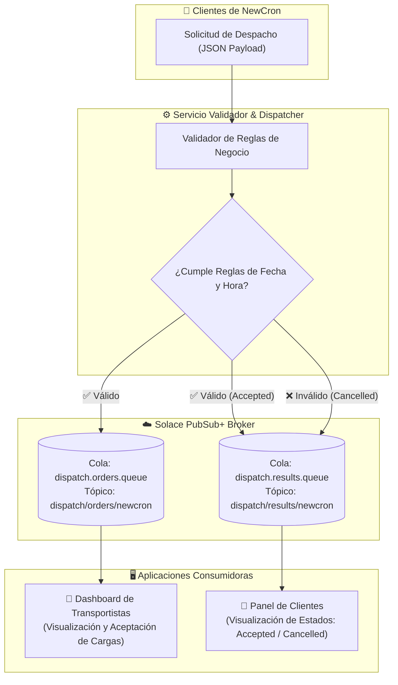

# Global Dispatch System — NewCron & Solace PubSub+

Sistema asíncrono y distribuido para la gestión y validación de órdenes de transporte de vehículos (*car hauling*) en Estados Unidos para la empresa **NewCron**, utilizando **Solace PubSub+** como bróker de mensajería empresarial para garantizar desacoplamiento, entrega confiable de eventos y persistencia.

---

## 1. Descripción del Proyecto

El sistema automatiza el flujo de despacho entre los predios automotrices (clientes/shippers) y los conductores de camiones nodriza (transportistas/carriers). 

Antes de asignar cualquier carga a un transportista, el sistema valida estrictamente las fechas y la hora de recepción de la solicitud contra las reglas de negocio de NewCron. Si la orden es aprobada, se transmite a la cola de transportistas; si no cumple alguna regla, se cancela automáticamente y se le notifica al cliente el motivo exacto del rechazo.

---

## 2. Reglas de Validación de Negocio

El servicio publicador (`src/publisher`) evalúa 3 reglas obligatorias antes de enviar la orden a los transportistas:

| Regla | Condición | Comportamiento en caso de incumplimiento |
| :--- | :--- | :--- |
| **Regla 1: Recolección no retroactiva** | La fecha de recolección debe ser igual o posterior a la fecha actual (`pickupDate >= current_date`). | Se cancela la orden con la nota:<br>`"Pickup date cannot be earlier than the current date."` |
| **Regla 2: Límite horario para el mismo día** | Si la recolección es para el mismo día (`pickupDate == current_date`), la solicitud debe enviarse a más tardar a las **3:00 p.m. (15:00 hrs)**. | Se cancela la orden con la nota explicativa:<br>`"Same-day pickup requests cannot be submitted after 3:00 p.m."` |
| **Regla 3: Margen mínimo de entrega** | La fecha de entrega debe ser al menos 1 día posterior a la recolección (`deliveryDate > pickupDate` con $\ge 24\text{ horas}$). | Se cancela la orden indicando:<br>`"Delivery date must be at least one day after pickup date."` |

---

## 3. Arquitectura de Mensajería con Solace PubSub+

El sistema implementa una **Arquitectura Dirigida por Eventos (EDA)** y utiliza **Mensajería Garantizada (*Guaranteed Messaging*)** mediante el mapeo de tópicos taxonómicos a colas persistentes exclusivas:



```text
[Cliente / Shipper]
       │
       ▼
[Servicio Validador / Publisher]
       │
       ├── Si es VÁLIDA ────► Tópico: dispatch/orders/newcron  ──► Cola: dispatch.orders.queue  ──► [Dashboard Transportistas]
       │
       └── Resultado ───────► Tópico: dispatch/results/newcron ──► Cola: dispatch.results.queue ──► [Panel de Clientes]
           (Accepted / Cancelled)
```

### Configuración de Colas y Tópicos:
* **`dispatch.orders.queue` (Persistente / Exclusiva):**  
  Suscrita al tópico `dispatch/orders/newcron`. Almacena únicamente órdenes válidas para que los choferes las visualicen y acepten.
* **`dispatch.results.queue` (Persistente / Exclusiva):**  
  Suscrita al tópico `dispatch/results/newcron`. Almacena el resultado del procesamiento (`Accepted` o `Cancelled` con el motivo) para consulta del cliente.

---

## 4. Estructura del Código

```text
global-dispatch-solace/
├── src/
│   ├── config/
│   │   └── solace.config.ts        # Credenciales y constantes de tópicos/colas
│   ├── types/
│   │   └── dispatch.ts             # Interfaces TypeScript (Order, Stop, Vehicle, Results)
│   ├── utils/
│   │   ├── validator.ts            # Lógica matemática de las 3 reglas de negocio
│   │   └── solace-client.ts        # Cliente de conexión, publicación y consumo Solace
│   ├── publisher/
│   │   ├── publisher.service.ts    # Servicio de validación y despacho
│   │   └── index.ts                # Ejecución de escenarios de prueba por consola
│   ├── consumer-carriers/
│   │   ├── carrier-dashboard.ts    # Consumidor de dispatch.orders.queue
│   │   └── index.ts                # Punto de entrada para transportistas
│   ├── consumer-clients/
│   │   ├── client-panel.ts         # Consumidor de dispatch.results.queue
│   │   └── index.ts                # Punto de entrada para clientes
│   └── web/
│       ├── server.ts               # Servidor Express con Server-Sent Events (SSE)
│       └── public/
│           ├── index.html          # Interfaz web interactiva con Tailwind y Toastify
│           ├── css/
│           │   └── styles.css      # Estilos personalizados
│           └── js/
│               ├── app.js          # Orquestador del frontend y eventos
│               ├── api.js          # Peticiones HTTP y conexión SSE
│               ├── storage.js      # Persistencia de órdenes en LocalStorage
│               └── ui.js           # Renderizado de interfaz y notificaciones Toastify
├── tests/
│   └── validator.test.ts           # Suite de 13 pruebas unitarias automatizadas
├── .env.example                    # Plantilla de variables de entorno
├── package.json                    # Dependencias y scripts de ejecución
└── tsconfig.json                   # Configuración del compilador TypeScript 5
```

---

## 5. Instalación y Configuración

### Prerrequisitos
* **Node.js:** Versión 18.x, 20.x o 22.x instalada.
* **npm:** Gestor de paquetes incluido con Node.js.
* Instancia activa en **Solace PubSub+ Cloud**.

### Paso 1: Clonar el repositorio e instalar dependencias
```bash
git clone https://github.com/Lilian1306/global-dispatch-solace.git
cd global-dispatch-solace
npm install
```

### Paso 2: Configurar las variables de entorno
Crea un archivo `.env` en la raíz del proyecto basándote en `.env.example`:

```bash
cp .env.example .env
```

Define las credenciales de tu servicio en Solace Cloud:
```env
SOLACE_HOST=wss://<tu-servicio>.messaging.solace.cloud:443
SOLACE_VPN_NAME=<nombre-de-tu-vpn>
SOLACE_USERNAME=<tu-usuario>
SOLACE_PASSWORD=<tu-contraseña>
```

---

## 6. Ejecución de Pruebas Unitarias

El proyecto cuenta con **13 pruebas automatizadas** que validan casos límite (límites de las 3:00 PM, 15:00 vs 15:01, fechas retroactivas, entregas en el mismo día y el escenario de carga oficial del documento):

```bash
npm test
```

---

## 7. Formas de Ejecución del Sistema

Se puede interactuar con el sistema de dos formas:

### Opción A: Interfaz Web Interactiva (Recomendada)
Inicia el servidor web que unifica el despacho de clientes y los tableros en tiempo real:

```bash
npm run start:web
```

Abre en tu navegador: **`http://localhost:3000`**

* **Formulario interactivo:** Permite ingresar cualquier orden con fechas libres y enviarla mediante el botón **"Enviar solicitud"**.
* **Probar escenarios con Mock Data (1-clic):** Permite cargar instantáneamente los 4 casos de prueba preconfigurados con un solo clic:
  * **1. Solicitud Válida** (Camino feliz / aprobada)
  * **2. Fecha Pasada** (Incumple Regla 1)
  * **3. Fuera de Horario** (Incumple Regla 2 — Hoy después de las 3:00 PM)
  * **4. Entrega Mismo Día** (Incumple Regla 3 — Margen menor a 24 horas)
* **Notificaciones Toastify:** Avisos emergentes en tiempo real en la esquina superior derecha indicando aprobación o motivo de rechazo.
* **Tableros en vivo:** Muestran la llegada de cargas en **"Cargas disponibles"** y las respuestas en **"Mis solicitudes"** vía Server-Sent Events (SSE).

---

### Opción B: Ejecución Modular por Consola
Si se desea probar cada microservicio por separado en terminales independientes:

1. **Terminal 1 — Dashboard de Transportistas:**
   ```bash
   npm run start:carriers
   ```
2. **Terminal 2 — Panel de Clientes:**
   ```bash
   npm run start:clients
   ```
3. **Terminal 3 — Publicador de Pruebas:**
   ```bash
   npm run start:publisher
   ```

---

## 8. Escenarios de Prueba Contemplados

| # | Escenario (Mock Data) | Entrada | Resultado Esperado |
| :-: | :--- | :--- | :--- |
| **1** | **Solicitud Válida** | Recolección (*pickup*) = Mañana, Entrega (*delivery*) = Pasado mañana | Orden publicada a transportistas y estado `Accepted` para el cliente. |
| **2** | **Fecha Pasada** | Recolección (*pickup*) = Ayer | Cancelada con `"Pickup date cannot be earlier than the current date."`. No llega a transportistas. |
| **3** | **Fuera de Horario** | Recolección (*pickup*) = Hoy, hora de envío > 15:00 hrs | Cancelada con `"Same-day pickup requests cannot be submitted after 3:00 p.m."`. No llega a transportistas. |
| **4** | **Entrega Mismo Día** | Recolección (*pickup*) = Mañana, Entrega (*delivery*) = Mañana | Cancelada con `"Delivery date must be at least one day after pickup date."`. No llega a transportistas. |

---

## 9. Un problema real que nos topamos durante las pruebas (y cómo lo resolvimos)

Vale la pena dejar esto documentado porque nos costó varias horas encontrarlo, y si algún día el sistema vuelve a comportarse raro, lo primero que hay que revisar es esto.

**Lo que notamos:** cuando una orden se cancelaba (por cualquiera de las 3 reglas de negocio), el panel de clientes en la interfaz web se quedaba mudo — ni la notificación emergente ni la fila nueva en la tabla aparecían. Las órdenes aprobadas sí se veían, así que en un principio sospechamos del código: revisamos el formulario, la función que pinta las tarjetas, buscamos errores de JavaScript en la consola del navegador. Nada.

Confirmamos con la consola del navegador que la petición al servidor sí llegaba, se validaba bien y regresaba el JSON correcto (`status: "Cancelled"` con el motivo exacto). El problema no estaba ahí. Publicando mensajes directo a Solace desde la terminal, sin pasar por el navegador, pasaba lo mismo: el resultado nunca le llegaba a ningún consumidor. Y al mirar con más cuidado, nos dimos cuenta de que ni siquiera las órdenes aprobadas estaban mostrando el aviso correcto — lo que veíamos era otra notificación (la del tablero de transportistas), que nos hizo pensar erróneamente que "sí funcionaba".

**La causa real** no era del código de la aplicación, sino de cómo quedó configurada la cola `dispatch.results.queue` en Solace Cloud. Es una cola de tipo **Exclusive**: Solace le entrega todos los mensajes únicamente al primer cliente que se conectó a ella, y cualquier otro que se conecte después se queda esperando sin recibir nada mientras ese primero siga vivo.

Durante el desarrollo arrancamos y detuvimos el servidor muchísimas veces para ir probando cosas, y en algún momento una de esas conexiones no se cerró bien del lado de Solace — se quedó viva ahí, acumulando en silencio los mensajes de resultado (46 en total, los contamos), mientras que cada servidor nuevo que levantábamos se conectaba sin ningún error pero nunca recibía nada, porque la cola ya tenía "dueño". Lo confirmamos entrando a la consola de Solace Cloud, pestaña "Consumers" de `dispatch.results.queue`: había 5 conexiones activas al mismo tiempo, y solo una de ellas tenía mensajes entregados. Las otras 4 —incluida la del servidor que estábamos usando en ese momento— estaban en cero.

**Cómo lo arreglamos:** la consola básica de Solace Cloud no da una opción directa para desconectar un cliente específico, así que optamos por lo más contundente: borramos por completo la cola `dispatch.results.queue`, lo que corta de un jalón todas las conexiones atadas a ella (incluida la que se estaba quedando con todo), y la volvimos a crear desde cero con la misma configuración (Exclusive, suscrita al tópico `dispatch/results/newcron`). Reiniciamos el servidor para que se conectara limpio a la cola nueva, y desde entonces todo funciona con normalidad.

> **Si vuelve a pasar:** entra a Solace Cloud → la cola en cuestión → pestaña "Consumers", y revisa si hay más de una conexión activa. Si es así, borra y recrea la cola.

---
