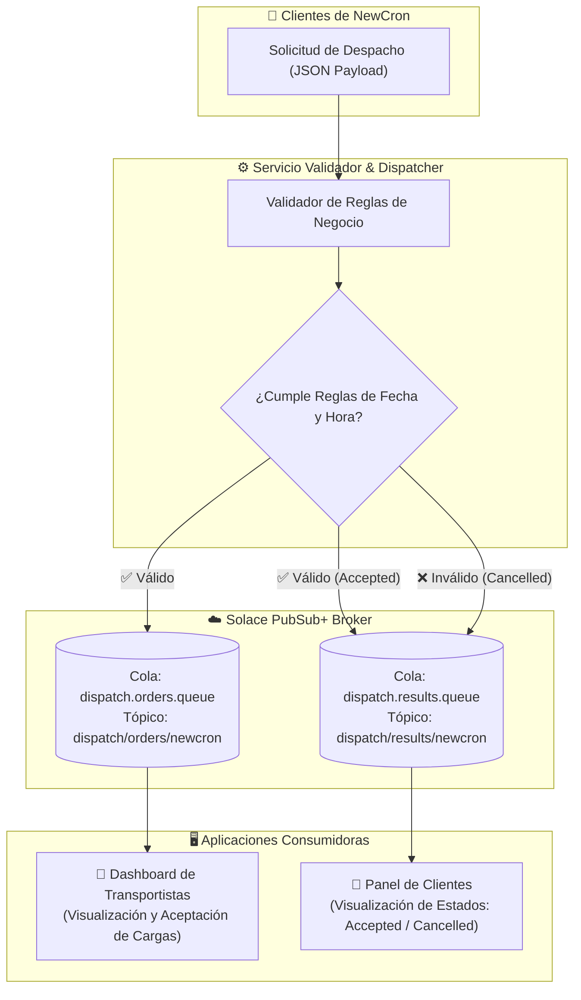

# 🚚 Global Dispatch System — NewCron & Solace PubSub+

[](https://www.typescriptlang.org/)
[](https://nodejs.org/)
[](https://solace.com/)
[](https://opensource.org/licenses/ISC)

Sistema distribuido y asíncrono para la gestión y despacho de órdenes de transporte de vehículos (*car hauling*) en Estados Unidos para la empresa **NewCron**, integrando **Solace PubSub+** como bróker de mensajería empresarial para garantizar desacoplamiento, alta disponibilidad y entrega confiable de eventos.

---

## 📋 Tabla de Contenidos
1. [📅 Plan de Trabajo](#-1-plan-de-trabajo)
2. [🏗️ Arquitectura del Sistema](#-2-arquitectura-del-sistema)
3. [⚙️ Reglas de Validación de Negocio](#-3-reglas-de-validación-de-negocio)
4. [📂 Estructura de Tópicos y Colas en Solace](#-4-estructura-de-tópicos-y-colas-en-solace)
5. [📦 Modelos y Payloads JSON](#-5-modelos-y-payloads-json)
6. [🗂️ Estructura del Proyecto](#-6-estructura-del-proyecto)
7. [🚀 Instalación y Configuración](#-7-instalación-y-configuración)
8. [🧪 Escenarios y Casos de Prueba](#-8-escenarios-y-casos-de-prueba)
9. [📬 Datos de Entrega](#-9-datos-de-entrega)

---

## 📅 1. Plan de Trabajo

El plan de trabajo fue diseñado y distribuido para ejecutarse en el periodo del **lunes 21 al domingo 27 de septiembre de 2026**, cumpliendo estrictamente con la fecha de entrega y cubriendo todas las especificaciones requeridas en el documento de requerimientos:

| Fase | Días | Hitos y Actividades Principales | Estado |
| :--- | :--- | :--- | :---: |
| **Fase 1: Análisis y Base** | **Lun 21 - Mar 22** | • Análisis de requerimientos funcionales y reglas de negocio.<br>• Creación de la instancia en Solace PubSub+ Cloud (Message VPN, Colas y Suscripciones).<br>• Definición de modelos de datos TypeScript y lógica de validación de fechas/horarios. | Completado |
| **Fase 2: Servicios, Consumidores y Web UI** | **Mié 23 - Jue 24** | • Construcción del servicio publicador (`publisher`) con validación previa.<br>• Implementación del Consumidor 1: *Dashboard de Transportistas* (`consumer-carriers`).<br>• Implementación del Consumidor 2: *Panel de Clientes* (`consumer-clients`).<br>• Desarrollo de la capa Web UI interactiva (Express, Tailwind CSS, notificaciones con Toastify) para visualización en tiempo real. | Backend Completado / UI Pendiente |
| **Fase 3: Pruebas y Validación** | **Vie 25 - Sáb 26** | • Pruebas unitarias y de integración de las 3 reglas de negocio.<br>• Pruebas de casos borde (horario límite 3:00 PM, fechas retroactivas, diferencia de días).<br>• Verificación de persistencia y consumo en colas de Solace. | Completado |
| **Fase 4: Documentación y Entrega** | **Dom 27** | • Finalización y estilo del `README.md`.<br>• Preparación del repositorio con `.gitignore` higiénico.<br>• Envío formal del proyecto antes de las 23:55 hrs. | Listo para Entrega |

> [!NOTE]
> **Alineación con los requerimientos:** El plan contempla el ciclo de vida completo de la solución: validación de entrada, mensajería garantizada en Solace PubSub+, dashboards desacoplados para transportistas y clientes, y pruebas exhaustivas.

---

## 🏗️ 2. Arquitectura del Sistema

El sistema implementa una **Arquitectura Dirigida por Eventos (EDA)** donde los componentes interactúan mediante mensajería garantizada (*Guaranteed Messaging*):



### Componentes de la Solución:
1. **Servicio Validador / Publicador (`src/publisher`)**:
   - Recibe la solicitud original enviada por el predio automotriz.
   - Aplica rigurosamente las 3 validaciones de negocio sobre las fechas y la hora de recepción.
   - Si la solicitud es válida:
     - Publica la orden de carga completa en la cola de pedidos para transportistas.
     - Publica un evento de estado `Accepted` en la cola de resultados para el cliente.
   - Si la solicitud es inválida:
     - Publica un evento de estado `Cancelled` con el motivo en la cola de resultados para el cliente.
2. **Dashboard para Transportistas (`src/consumer-carriers`)**:
   - Escucha la cola `dispatch.orders.queue`.
   - Muestra las órdenes disponibles en tiempo real para que los conductores de *car haulers* puedan revisar la ruta, vehículos y aceptar la carga.
3. **Panel de Clientes (`src/consumer-clients`)**:
   - Escucha la cola `dispatch.results.queue`.
   - Informa en tiempo real al dueño del predio si su orden fue aprobada o cancelada y el motivo.
4. **Capa Web UI Interactiva (`src/web` o `src/server`)**:
   - Servidor web ligero con Express que expone un dashboard visual accesible vía navegador.
   - Pestañas desacopladas para: Creador de solicitudes de clientes (con botones de prueba rápida de 1-clic), Dashboard de transportistas en vivo y Panel de estado de órdenes.
   - Sistema de notificaciones flotantes en tiempo real mediante **Toastify** en la esquina superior derecha (avisos de carga disponible, aprobación o rechazo).

---

## ⚙️ 3. Reglas de Validación de Negocio

Antes de publicar cualquier carga a los transportistas, NewCron verifica las siguientes condiciones indispensables:

| Regla | Descripción de la Condición | Comportamiento si Incumple |
| :---: | :--- | :--- |
| **Regla 1** | **Fecha de Pick-up no anterior a hoy:**<br>`pickupDate >= current_date` | Se cancela la solicitud con la nota:<br>`"Pickup date cannot be earlier than the current date."` |
| **Regla 2** | **Restricción horaria para Pick-up el mismo día:**<br>Si `pickupDate == current_date`, la solicitud debe ser recibida a más tardar a las **3:00 p.m. (15:00 hrs)**. | Se cancela la solicitud con la nota explicativa:<br>`"Same-day pickup requests cannot be submitted after 3:00 p.m."` |
| **Regla 3** | **Margen mínimo de Delivery:**<br>`deliveryDate > pickupDate` con al menos **1 día de diferencia** ($\ge 24\text{ horas}$). | Se cancela la solicitud indicando:<br>`"Delivery date must be at least one day after pickup date."` |

> [!IMPORTANT]
> **Manejo de Zona Horaria:** Para mantener la integridad en transacciones distribuidas en Estados Unidos, los cálculos de `current_date` y hora límite se basan en el tiempo del servidor sincronizado (o zona horaria operativa definida en la configuración del servicio).

---

## 📂 4. Estructura de Tópicos y Colas en Solace

Siguiendo las **mejores prácticas de Solace** (jerarquía de tópicos taxonómica y mapeo *Topic-to-Queue* para colas exclusivas/no exclusivas con persistencia garantizada):

| Nombre de Cola | Tipo | Suscripción a Tópico | Propósito |
| :--- | :---: | :--- | :--- |
| `dispatch.orders.queue` | Cola (Persistent) | `dispatch/orders/newcron` | Almacena pedidos válidos listos para ser visualizados y aceptados por los choferes de *car haulers*. |
| `dispatch.results.queue` | Cola (Persistent) | `dispatch/results/newcron` | Almacena el resultado del procesamiento (`Accepted` / `Cancelled`) para consulta y notificación de los clientes. |

---

## 📦 5. Modelos y Payloads JSON

### A. Payload de Solicitud de Carga (Entrada - NewCron)
```json
{
  "shipperOrderId": "6600111",
  "pickupDate": "2026-09-21",
  "deliveryDate": "2026-09-22",
  "price": 900,
  "stops": [
    {
      "stopNumber": 1,
      "city": "Milford",
      "state": "MA",
      "postalCode": "01757"
    },
    {
      "stopNumber": 2,
      "city": "Shippensburg",
      "state": "PA",
      "postalCode": "17257"
    }
  ],
  "vehicles": [
    {
      "year": "2010",
      "make": "Toyota",
      "model": "Corolla"
    }
  ],
  "transportationReleaseNotes": "Verify the pickup date; shipments cannot be delivered after 3:00 p.m. on the current date or on previous days."
}
```

### B. Payload de Solicitud Aceptada (`Accepted`)
Publicado a la cola de resultados cuando el payload supera todas las validaciones:
```json
{
  "shipperOrderId": "6600111",
  "status": "Accepted",
  "notes": "You will receive an email when a carrier accepts this dispatch request"
}
```

### C. Payload de Solicitud Cancelada (`Cancelled`)
Publicado a la cola de resultados cuando se rechaza la solicitud:
```json
{
  "shipperOrderId": "7743789",
  "status": "Cancelled",
  "notes": "Pickup date cannot be earlier than the current date."
}
```

---

## 🗂️ 6. Estructura del Proyecto

```text
global-dispatch-solace/
├── .env.example                # Plantilla de variables de entorno
├── .gitignore                  # Exclusiones de Git (node_modules, .env, PDFs, logs)
├── package.json                # Dependencias y scripts del proyecto
├── tsconfig.json               # Configuración de compilación TypeScript
├── README.md                   # Documentación principal del sistema
└── src/
    ├── index.ts                # Punto de entrada principal
    ├── publisher/              # Servicio validador y emisor de eventos
    ├── consumer-carriers/      # Dashboard para transportistas de car haulers
    ├── consumer-clients/       # Panel de visualización de estados para clientes
    ├── web/                    # Capa Web UI (servidor Express, vistas Tailwind y Toastify)
    └── utils/                  # Conexión Solace PubSub+, validadores y utilitarios
```

---

## 🚀 7. Instalación y Configuración

### Prerrequisitos
- [Node.js](https://nodejs.org/) versión **18.x** o superior.
- Gestor de paquetes `npm`.
- Cuenta activa en **Solace PubSub+ Cloud** o broker Solace local (Docker / Appliance).

### Paso 1: Clonar el repositorio
```bash
git clone https://github.com/<tu-usuario>/global-dispatch-solace.git
cd global-dispatch-solace
```

### Paso 2: Instalar dependencias
```bash
npm install
```

### Paso 3: Configurar variables de entorno
Crea un archivo `.env` a partir de `.env.example`:
```bash
cp .env.example .env
```

Define las credenciales de tu servicio en Solace PubSub+:
```env
SOLACE_HOST=wss://<tu-servicio-solace>.messaging.solace.cloud:443
SOLACE_VPN_NAME=<nombre-de-tu-vpn>
SOLACE_USERNAME=<tu-usuario>
SOLACE_PASSWORD=<tu-contraseña>
```

### Paso 4: Ejecución del Sistema
Puedes correr los módulos mediante TypeScript:
```bash
# Iniciar la interfaz web interactiva (Web UI + Toastify)
npm run start:web

# Iniciar el publicador / validador de solicitudes en consola
npm run start:publisher

# Iniciar el dashboard de transportistas en consola
npm run start:carriers

# Iniciar el panel de clientes en consola
npm run start:clients
```

---

## 🧪 8. Escenarios y Casos de Prueba

| # | Caso de Prueba | Entrada | Resultado Esperado |
| :-: | :--- | :--- | :--- |
| **1** | **Happy Path (Válido)** | `pickupDate = mañana`, `deliveryDate = pasado mañana` | Publica en `dispatch.orders.queue` y emite `Accepted` en `dispatch.results.queue`. |
| **2** | **Fecha pasada** | `pickupDate = ayer` | Emite `Cancelled` con `"Pickup date cannot be earlier than the current date."`. No se envía a transportistas. |
| **3** | **Mismo día fuera de hora** | `pickupDate = hoy`, hora de envío = 16:30 hrs | Emite `Cancelled` con `"Same-day pickup requests cannot be submitted after 3:00 p.m."`. No se envía a transportistas. |
| **4** | **Delivery inválido** | `pickupDate = mañana`, `deliveryDate = mañana` | Emite `Cancelled` con `"Delivery date must be at least one day after pickup date."`. No se envía a transportistas. |

---

## 📬 9. Datos de Entrega

- **Destinatarios del proyecto:**
  - `jorge.acevedo@guatemaltek.com`
  - `natan.saquic@guatemaltek.com`
- **Fecha y hora límite:** Domingo 27 de septiembre a las 23:55 horas.
- **Formato:** Enlace al repositorio de código (GitHub) con solución completa y documentación en `README.md`.